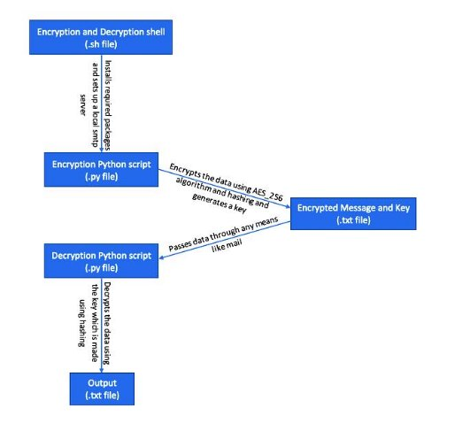
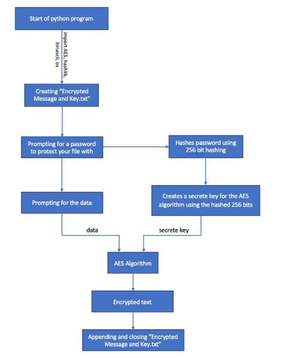

October 2021

**D A T A**

**E N C R YP T IO N**

**EXPOS YS DATA LABS**

Prepared by: UBAID AKHTAR GHANTE Software Engineer Intern at

[Exposys Dat](https://github.com/Ubaid-Ghante/DataEncryptionExposys)a Labs

[GitHub Link](https://github.com/Ubaid-Ghante/DataEncryptionExposys)

**Abstract**

Encryption is the science of providing security and protection of information. It is used everywhere in our digital world: when you open a Web site, send an email or connect to the WiFi network. That's why developers should have at least basic understanding of cryptography and how to use crypto algorithms and crypto libraries, to understand hashing, symmetric and asymmetric ciphers and encryption schemes, as well as digital signatures and the cryptosystems and algorithms behind them.

Cryptography deals with storing and transmitting data in a secure way, such that only those, for whom it is intended, can read and process it. This may involve encrypting and decrypting data using symmetric or asymmetric encryption schemes, where one or more keys are used to transform data from plain to encrypted form and back.

Using AES 256 bit algorithm and hashing we can reach a fair bit of security.

**Table of content**

1. Abstract 02
1. Table of Contents 03
1. Introduction 04
1. Proposed method with Architecture 05
   1. Methodology
   1. Architecture
1. Implementation 08
1. Conclusion 09

**Introduction**

Encryption...is a powerful defensive weapon for free people. It offers a technical guarantee of privacy, regardless of who is running the government... It's hard to think of a more powerful, less dangerous tool for liberty.

In cryptography, encryption is the process of encoding information. This process converts the original representation of the information, known as plaintext, into an alternative form known as ciphertext. Ideally, only authorized parties can decipher

a ciphertext back to plaintext and access the original information. Encryption does not itself prevent interference but denies the intelligible content to a would-be interceptor.

For technical reasons, an encryption scheme usually uses a pseudo- random encryption key generated by an algorithm.

It is possible to decrypt the message without possessing the key but, for a well-designed encryption scheme, considerable computational resources and skills are required. An authorized recipient can easily decrypt the message with the key provided by the originator to recipients but not to unauthorized users.

**Proposed Method**

After going through lot of different available algorithms I have reached a point where I can use the existing algorithms with some changes and using more than one algorithm to combined together to form a secure and we'll managed system for your data.

Method

In this project I have used python as my preferred programming language as it gives many existing libraries that help in strong encryption. The libraries that I used for encryption, sending data and hashing are:

pycryptodome smtplib hashlib

os

binascii

Using a bash shell as a starting point is to ensure that all the required libraries are installed and up to date for proper functioning of the program. This helps in running more than one python script for encryption and decryption both and also a python script to send the encrypted data.Also a localhost will be created to demonstrate the project.

**Architecture**

First let's see the flow of data through different files

The shell file first installs all the required libraries that are need for encryption of data and then runs the python file which encrypts data and saves it in the "Encrypted Message and Key.txt" file. Now by which ever method you want can send this file to the receiver which then decrpyts the message and moves the data to "Output.txt" file. All this is done locally as to demonstrate the project so I have set a local SMTP server which takes the msg as a mail and forwards it.

Now let's se what is going inside the python file

First let's import the libraries that we will need to use that are AES from Crypto.Cipher, binascii, os, hashlib and smtplib. Then creating a file to store the data that will be transferred to the recipient. The program asks you to input a password that will be used as a key for your data to be unlocked. The key

entered will be converted to a 256 bit hash that will be used as a entropy for the encryption this makes it easy for decryption if and only if you know the password  that is the key. You have to enter your data then the data and the secret key will be passed into AES 256 bit algorithm which then saves the Encrypted data in "Encrypted Message and Key.txt".

**Implementation**

Algorithms use keys to encrypt and decrypt data. Encrypting the same data with a different key will produce a different result. Just as it is important to choose the right algorithm, it is also important to ensure that the key size is sufficiently large to defend against an attack over the lifetime of the data. As computing processing power increases or new mathematical attack methods are discovered, a key must remain sufficiently large to ensure that an attack remains a practical impossibility.

Data controllers should therefore regularly assess whether their encryption keys remain sufficiently large to prevent a brute force or other method of attack. They should also assess the risks and likelihood of an attack given the amount of personal data they hold.

Progress of mobile communication and VLSI technology has aided in development of smart devices. These devices process the information of various formats and sizes in a limited amount of time. This information will be either stored in the devices or in cloud, hence there is a need for some kind of methodology to process and secure the data. Implementation of new algorithms to secure the information is always of immense interest. These algorithms will improve the performance of smart devices and helps for better human-machine interaction. Generally, symmetric and asymmetric approaches are used to secure the data from unauthorized users or attacks. Considering the amount of delay and complexity involved in processing the data, various forms of algorithms are used. In this paper, we propose a novel algorithm to secure the data from vulnerable attacks. These algorithms can be implemented on various platforms. The experimental results demonstrate an improvement of 10% for contacts and 15% for the encryption of images as compared to other conventional approaches.

**Conclusion**

Privacy is a basic right that can only be achieved by encryption.

In today's world encryption is a necessity and a programmer's job is to provide that. In this project rather than saving the password in a hash file and cross checking it at the receiver's end we have used the hash as an entropy for the encryption. This saves a lot of unnecessary data that will be transmitted back and forth for verification of the hash. Just know the password and you are good to go. This gives ease for the user and makes it much safer than just using a algorithm. 

By:-

Ubaid Akhtar Ghante
